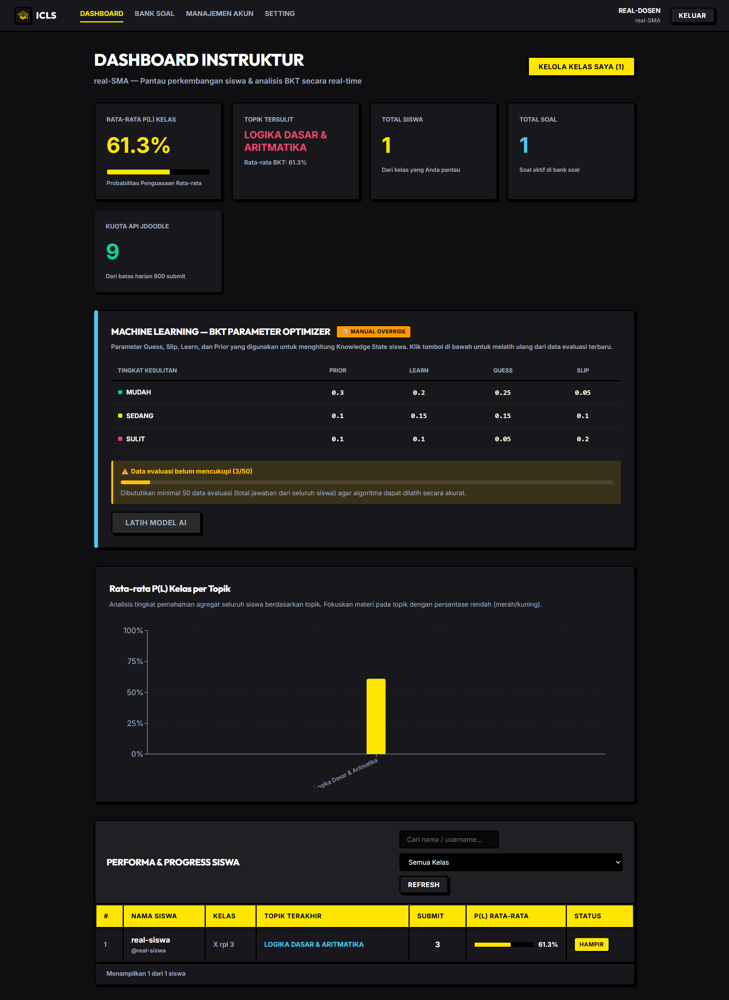
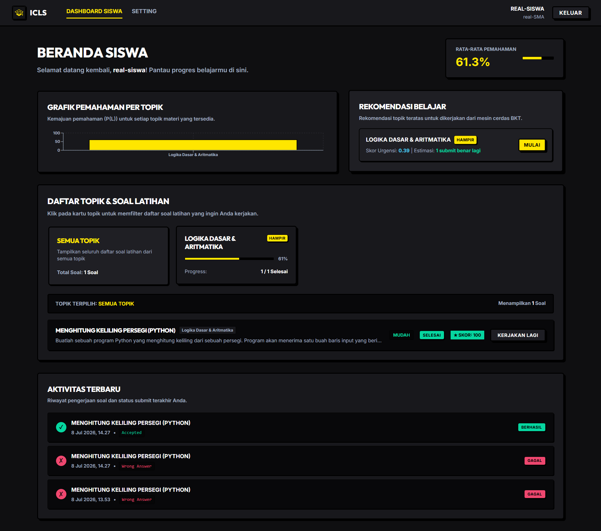
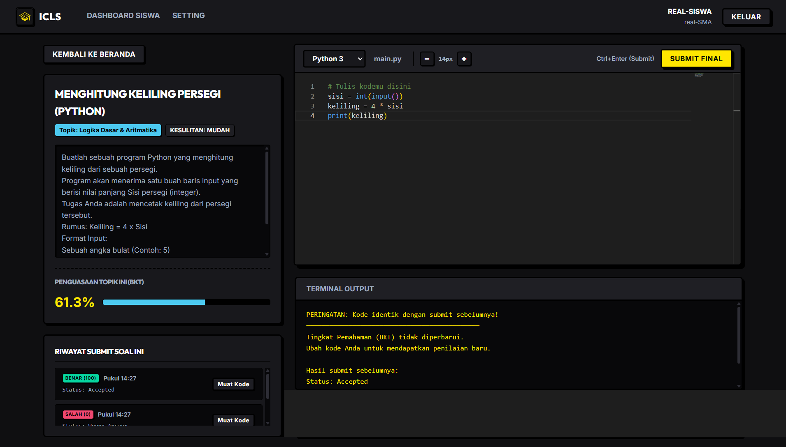
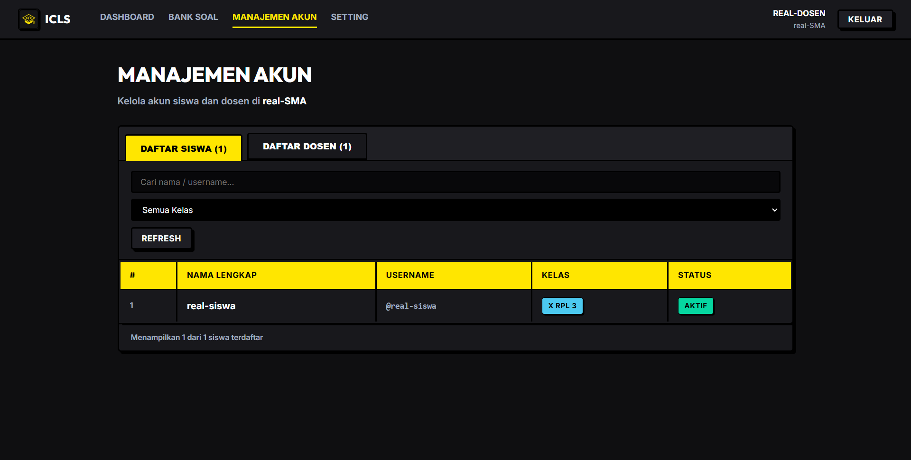

# ICLS — Interactive Coding Learning System

> A full-stack interactive platform for learning to code, featuring a live in-browser code editor, structured curriculum, and progress tracking.

[]()
[]()
[]()
[](LICENSE)

---

## About The Project

ICLS (Interactive Coding Learning System) is a capstone project built to solve a common problem: most online coding platforms require complex setups. ICLS provides an all-in-one learning environment where students can:

- Follow structured coding lessons
- Write and execute code directly in the browser (no setup required)
- Track their learning progress through charts and dashboards
- Get immediate feedback on their exercises

---

## Screenshots

**Teacher Dashboard**


**Student Dashboard**


**In-Browser Code Editor**


**Account Management**


---

## Features

- **Live In-Browser Code Editor** — Powered by Monaco Editor (same engine as VS Code)
- **Structured Lesson Modules** — Organized curriculum with chapters and exercises
- **Progress Tracking Dashboard** — Visual charts showing learning completion
- **RESTful API Backend** — Clean, documented FastAPI backend
- **User Authentication** — Secure login and session management
- **Role-Based Access** — Separate views for Teachers and Students
- **Responsive Design** — Works on desktop and mobile

---

## Tech Stack

| Layer | Technology |
|:---|:---|
| Frontend | React 19, Vite, Monaco Editor |
| Backend | FastAPI (Python) |
| ORM | SQLAlchemy |
| Database | MySQL |
| Styling | Tailwind CSS |
| Dev Tools | Git, NPM, pip |

---

## Folder Structure

```
ICLS-Capstone-Project/
├── frontend/               # React 19 + Vite frontend
│   ├── src/
│   │   ├── components/     # Reusable UI components
│   │   ├── pages/          # Page-level components (Dashboard, Editor, etc.)
│   │   ├── hooks/          # Custom React hooks
│   │   └── api/            # API client functions
│   └── public/
├── backend/                # FastAPI Python backend
│   ├── routers/            # API route handlers
│   ├── models/             # SQLAlchemy DB models
│   ├── schemas/            # Pydantic request/response schemas
│   └── main.py             # FastAPI app entry point
└── screenshots/            # Project screenshots
```

---

## Getting Started

### Prerequisites

- Node.js 18+
- Python 3.10+
- MySQL 8.0+

### Installation

**1. Clone the repository**
```bash
git clone https://github.com/Abdul-anip/ICLS-Capstone-Project.git
cd ICLS-Capstone-Project
```

**2. Backend Setup**
```bash
cd backend
pip install -r requirements.txt
cp .env.example .env
uvicorn main:app --reload
```

**3. Frontend Setup**
```bash
cd frontend
npm install
npm run dev
```

**4. Access the app**

Open [http://localhost:5173](http://localhost:5173) in your browser.

---

## License

Distributed under the MIT License. See [LICENSE](LICENSE) for more information.

---

## Author

**Abdul Hanif** — D4 Software Engineering Technology, Politeknik Negeri Padang

[](https://abdul-anip.github.io/CV/)
[](https://linkedin.com/in/abdul-hanif-78649b331)
